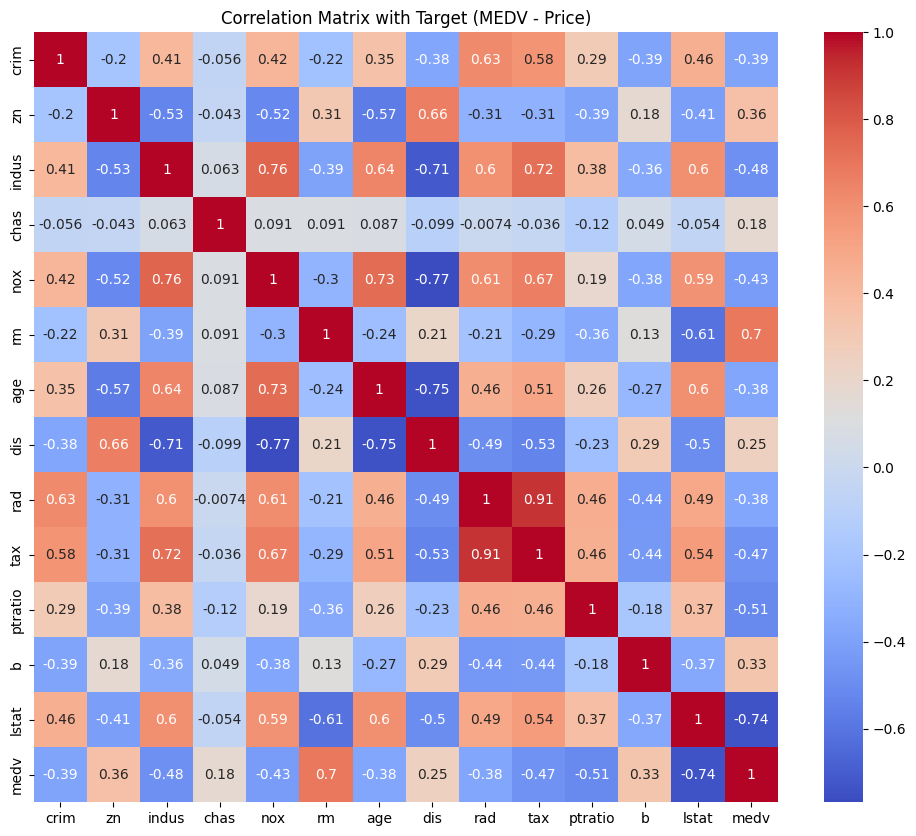
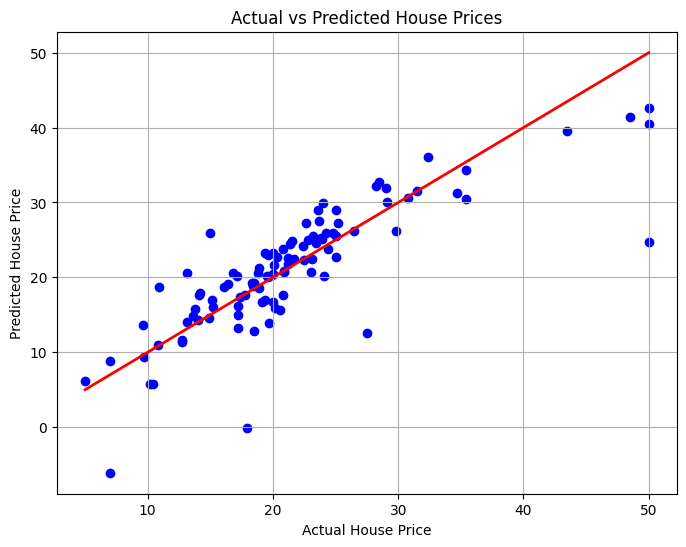

# 🏠 House Price Prediction using Multiple Linear Regression

This project uses Multiple Linear Regression to predict the **price of houses** in Boston based on various features like crime rate, number of rooms, distance to employment centers, etc.

---

## 📌 Objective

To build a regression model that can accurately predict the **median house price (in $1000s)** using multiple features from the **Boston Housing Dataset**.

---

## 📊 Dataset

**Dataset Name:** Boston Housing Dataset  
**Source:** [Kaggle / UCI / GitHub](https://raw.githubusercontent.com/selva86/datasets/master/BostonHousing.csv)

**Target Variable:** `medv` (Median value of owner-occupied homes)

**Features Include:**
- `crim` – crime rate
- `rm` – average number of rooms
- `lstat` – % lower status population
- `ptratio` – pupil-teacher ratio
- ... and others (13 total features)

---

## 🧰 Tools & Technologies Used

- **Python 3**
- **Google Colab**
- **Libraries**:
  - `pandas`
  - `numpy`
  - `matplotlib`
  - `seaborn`
  - `scikit-learn`

---

## 📈 Project Workflow

1. **Data Loading** – Load the CSV dataset directly from GitHub
2. **Exploratory Data Analysis (EDA)** – Inspect, describe, and clean data
3. **Correlation Analysis** – Use a heatmap to identify important features
4. **Train-Test Split** – 80% for training, 20% for testing
5. **Model Building** – Apply `LinearRegression` from `scikit-learn`
6. **Model Evaluation** – Evaluate with **R² Score** and **Mean Squared Error**
7. **Visualization** – Plot **Actual vs Predicted** house prices

---

## 📊 Results

- ✅ **R² Score:** ~0.73  
- ✅ **Mean Squared Error:** ~24.29  
- 📉 Good performance with interpretable feature importance  
- 📌 Strong positive correlation: `RM` (rooms)  
- 📌 Strong negative correlation: `LSTAT` (low income %)

---

## 📷 Sample Output

### 🔥 Heatmap of Feature Correlations

### 📊 Actual vs Predicted House Prices

---

## 📚 Learnings

- How regression models predict continuous values
- Importance of correlation analysis in feature selection
- End-to-end machine learning pipeline using Python
- Evaluating model accuracy using MSE and R²

---

## 💡 Future Improvements

- Apply **Ridge / Lasso Regression** to handle multicollinearity
- Use **Random Forest Regressor** for non-linear patterns
- Build a simple **web app** using Streamlit for real-time predictions

---

## 📎 License

This project is for academic and educational use. Feel free to fork or build upon it.

